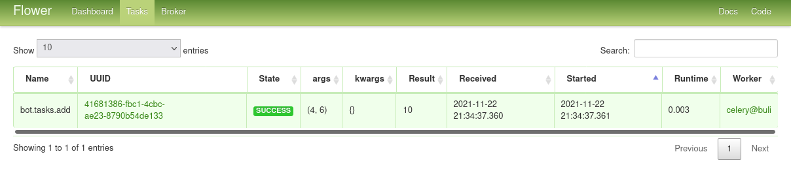
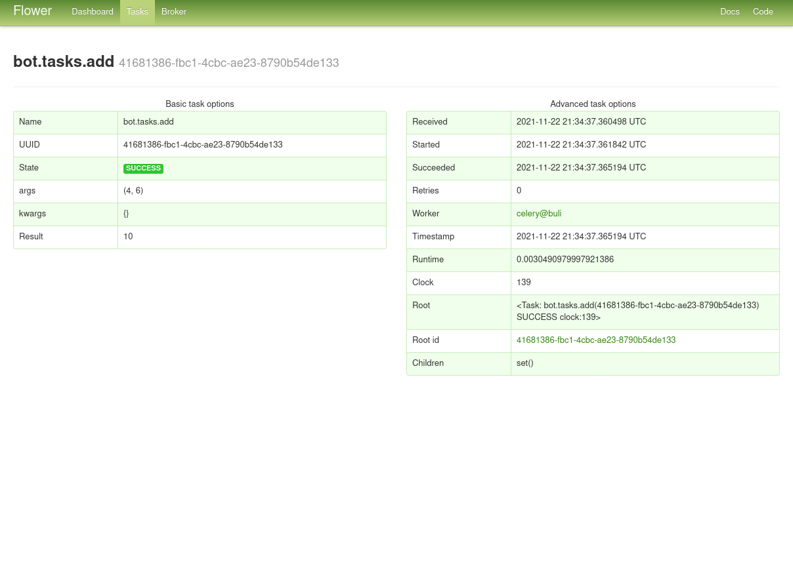

# SetUp Celery

Para configurar celery es necesario realizar varios pasos. Puedes revisar la documentación para tener más detalles. Aquí expicamos como configurarlo para este proyecto.

## Qué es celery
En simple es una cola de tareas un gestor de tareas. Eso significa que tu le pides algo para hacer y celery lo hará de manera asincrona o sincrona, y podrás consumir ese resultado más tarde. También puedes programar tareas.

> **¿Por qué celery?** La verdad es que hay varias soluciones para programar tareas en python. Pero la mayoría asumen que ese script es que funciona de "servidor", dicho de otra forma, se hace cargo de la ejecución de las tareas. En una app web del estilo nuestro, este tipo de arquitectura pone una carga pesada del lado del servidor. porque debe atender las demandas del usuario, que son crecientes (por eso Mongodb) y además procesar notificaciones o solicitudes de suscripción etc.
En ese sentido,  es mejor que la instancia que vela por las tareas funcione más como un servicio dedicado (un servicio de Linux por ejemplo). En una arquitectura distribuída, esto incluso significaría que a través del Broker las tareas pordrían estar en un servidor separado. Esto hace al sistema mucho más robustop y escalable sin complicar la lógica de código.

Es simple porque a nivel del proyecto las tareas se expresan como funciones de python que puedes llamar de una view, de un form o de cualquier parte del flujo dando muchísima libertad de acción. Una tarea de celery se ve así a nivel de código:

```python
from celery import Celery

app = Celery('tasks', broker='pyamqp://guest@localhost//')

@app.task
def add(x, y):
    return x + y
```

## Cómo Instalarlo
Primero hay que elegir un broker, celery siempre funciona con uno. En este caso es redis. Está explicado como instalarlo en el README.

Luego se instala para python
```sh
pip install celery celery-with-mongodb django-celery-beat flower
# más adelante veremos porque los otros modulos.
```

## Configurar Celery
_refs: [get started][3], ,_

Este sin duda es el peor dolor de cabeza para novatos, porque la documentación es bastante confusa para un setup que no es el standard (que usa el [ORM][0] de [Djago][2]). Pero trataremos de hacerlo lo más simple posible. Celery esta pensado para proyectos realmente complejos y muy customizables. Eso implica que hay muchísimos parámetros de configuración, por lo que los siguientes son solo algunos de ellos. Los demás se usan por default.


Primero añade la configuración de Django:
```python
# New apps:
INSTALLED_APPS = [
    'django.contrib.admin',
    'django.contrib.auth',
    # ...
    # celery
    'celery',
    # 'django_celery_results', 
    'django_celery_beat',
]

#   CELERY SETTINGS
CELERY_BROKER_URL = 'redis://localhost:6379'            # Fijate bien que la url de redis que configuraste sea la misma.

CELERY_ACCEPT_CONTENT = ['application/json']
CELERY_TASK_SERIALIZER = 'json'
CELERY_RESULT_SERIALIZER = 'json'
# CELERY_TIMEZONE = 'America/Santiago'

# CELERY MONGO SETTINGS
# ver nota
CELERY_RESULT_BACKEND = "mongodb"
CELERY_MONGODB_BACKEND_SETTINGS = {
    "host": "127.0.0.1",
    "port": 27017,
    "database": "jobs",
    "taskmeta_collection": "stock_taskmeta_collection",
}
```
> esta configuración es importantísima si quieres usar tareas que consumiras mucho tiempo despues, como en nuestro caso las notificaciones, es muy posible tener inconsistencias según la [docu de celery][5] al usar un broker como back_end en el caso de tareas de "larga duración" o "alta latencia" o "desfase", porque los resultados se van limpiando. Aunque usar una DB tiene sus limitaciones también.

Crea un modulo llamado `celery.py` (que te recomendamos que este en `API>celery.py`) y pon los siguientes parametros:

```python
from __future__ import absolute_import, unicode_literals
import os
from celery import Celery

# Establacer variables de ambiente
os.environ.setdefault('DJANGO_SETTINGS_MODULE', 'API.settings')

# nombre de la APP
app = Celery('API')

# De dónde sacar la configuración 
app.config_from_object('django.conf:settings', namespace='CELERY') # namespace=CELERY es para que los nombres seran CELERY_ALGO

# Que sepa solito cuales son sus tareas, sin que se lo digas explícitamente.
app.autodiscover_tasks() 

#Esto es para debbugear tareas (no idea how)
@app.task(bind=True)
def debug_task(self):
    print(f'Request: {self.request!r}')
```

luego en el modulo `API>__init__.py` agrega las siguintes lineas:
```python
from .celery import app as celery_app

__all__ = ('celery_app',)
```

Crea `tasks.py` (que te recomendamos que este en tu `app_django>task.py`). Luego dentro de `tasks.py` podrás tus tareas, cómo por ejemplo (no lo hagas ahora):
```python
from __future__ import absolute_import, unicode_literals

from celery import shared_task

@shared_task
def add(x, y):
    return x + y
```

Para ejecutar esas tareas puedes correr celery como servicio, abrir la cosola de python importar el modulo y ejecutarla como sigue. Sin embargo, re recomendamos ver la parte siguiente que está enfocada en django.
```sh
# esto en una terminal
celery -A API worker
```

```sh
# y esto en otra
>>> from tasks import add
>>> add.delay(4, 4)
```
Deberías ver algo cómo esto:
```
```

## Monitorear Celery (tareas)
Para hacer un mejor monitorero, celery recomienda varios modulos y además para guardar los resultados pymongo. Pero en nuestro caso se usa `djongo` que no es muy compatible por celery, por lo tanto no se puede guardar tareas con el tipico modulo de results de django (que funciona con el ORM, djongo usa un [ODM][7]). Para monitorear el las tareas, entonces no se puede usar el admin de djago. Por eso preferimos instalar [flower][]

Se instala así:
```sh
pip install flower
```

Puedes usarlo de varias maneras pero recomendamos estas dos:
```sh
# como un "worker" de celery
celery -A API flower --address=127.0.0.6 --port=5566
# como un container en docker
docker run -p 5555:5555 mher/flower
```
> celery ahora igual tiene un visor de eventos cli, lo puedes usar como:
```sh
celery -A proj events
```
Es un prof of concept y se recomienda usar flower.


luego para poder ver los estados y resultados tienes que correr:
```sh
# En otra consola. Recuerda que cada worker es como un servicio/programa
celery -A API worker -E # -E es para habilitar los eventos, flower depende de ellos
```

Al correr una tarea verás algo cómo esto:




## Referencias
[0]: https://blog.bitsrc.io/what-is-an-orm-and-why-you-should-use-it-b2b6f75f5e2a
[1]: https://es.wikipedia.org/wiki/Asignaci%C3%B3n_objeto-relacional
[2]: https://docs.djangoproject.com/en/3.2/topics/db/queries/
[3]: https://docs.celeryproject.org/en/master/getting-started/first-steps-with-celery.html
[4]: https://docs.celeryproject.org/en/2.2/configuration.html#conf-mongodb-result-backend
[5]: https://docs.celeryproject.org/en/2.2/userguide/tasks.html#task-result-backends
[6]: https://flower.readthedocs.io/en/latest/install.html#usage-examples
[7]: https://www.djongomapper.com/djongo-comparison/